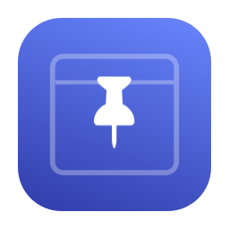
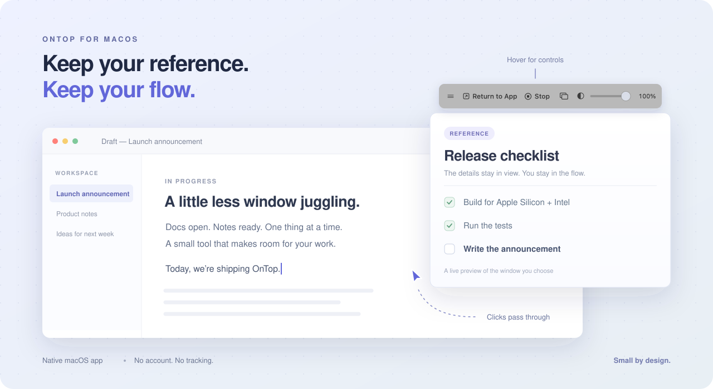

<div align="center">
  
  <h1>OnTop</h1>
  <p><strong>Your reference, always in sight.</strong></p>
  <p>A tiny native macOS app that floats a live window preview above your work.<br>Keep reading. Keep typing. Your clicks pass straight through.</p>
  <p>
    <a href="https://github.com/laixintao/ontop/actions/workflows/ci.yml"></a>
    <a href="https://github.com/laixintao/ontop/releases/latest"></a>
    <a href="#compatibility"></a>
    <a href="LICENSE"></a>
  </p>
  <p><a href="https://github.com/laixintao/ontop/releases/latest"><strong>Download for macOS →</strong></a> · <a href="README.zh-CN.md">简体中文</a> · <a href="https://github.com/laixintao/ontop/discussions">Discussions</a></p>
</div>



<p align="center"><sub>Illustrated workflow using sample content. OnTop displays the window you choose.</sub></p>

## A reference window that stays out of your way

Keep API docs beside your code, a diagram over your notes, or a checklist above your work—without rearranging your whole desktop.

- **Always visible.** A floating live preview across Spaces, with support for native fullscreen workspaces.
- **One preview per window.** Add multiple references, each with its own position, opacity, controls, and capture stream.
- **Click through.** Click, scroll, and select text in the window underneath the picture.
- **Controls when you need them.** Hover for Return to App, Stop, window selection, and opacity.
- **Back to the original.** Return to the source app and the preview gets out of the way. Switch away and it returns in place.
- **Make it fit.** Adjust opacity from 30–100%, move with the grip, and resize without stretching. Your layout and opacity are remembered.
- **Native and local.** Swift, AppKit, and ScreenCaptureKit. No account, analytics, network calls, or third-party app dependencies.

## Install

1. [Download the latest universal DMG](https://github.com/laixintao/ontop/releases/latest).
2. Open it and drag **OnTop** into **Applications**.
3. Launch OnTop, select a window in the macOS picker, and confirm sharing.

Apple Silicon and Intel use the same download. A ZIP is also available.

**First launch:** current releases use an ad-hoc signature and are **not Apple-notarized**. If macOS blocks the downloaded app, open **System Settings → Privacy & Security → Open Anyway** after attempting to launch it. See [Apple’s instructions](https://support.apple.com/en-us/102445). You can also [build from source](#build-from-source).

## Use it

The app lives in your menu bar: look for the **pin**. There is no Dock icon.


| What you want | What to do |
| --- | --- |
| Work underneath the preview | Click, drag, or scroll on the picture; events pass through. |
| Edit the source document | Hover and click **Return to App**. |
| Keep another reference visible | Choose **Add Window…** from the menu bar, then share another window. |
| Move or resize | Drag the left grip or the handle at the bottom-right corner. |
| Change opacity | Use the hover slider or the menu bar presets. |
| Replace one source | Click its overlapping-window button or **Choose another window** in that preview's menu. |
| Recover a layout | Open the preview's submenu and choose **Reset Preview Size**. |
| Finish | **Stop** closes that preview. **Stop All** closes every preview. **Quit OnTop** exits. |

OnTop shows a **live mirror**, not an interactive copy of the source app. Mouse events go to whatever window is actually underneath; they are not forwarded to the captured document.

## Compatibility

| Feature | Requirement |
| --- | --- |
| Preview, click-through, hover controls, opacity, movement, resizing | macOS 14+ |
| Return to App and automatic hide/restore for the source app | macOS 15.2+ |
| Prebuilt universal app | Apple Silicon or Intel |
| Build from source | Swift 6 and the macOS 15.2+ SDK; Xcode 16.2+ or compatible Command Line Tools |

<details>
<summary><strong>A few things to know</strong></summary>

- Add references one at a time with the system picker; each gets an independent preview at up to 15 fps. More shared windows use more CPU/GPU resources.
- If the source app is already active when you choose it, switch to another app to see its previews. Using any window of that source app hides all previews from that app; references from other apps stay visible. Which original window is raised is controlled by the source app.
- Minimized windows, sleeping apps, or protected content may pause or prevent capture. OnTop keeps the last available frame when possible.
- Spaces and native fullscreen are supported; exclusive fullscreen apps and system UI can impose their own window-ordering rules.
- Closing or stopping a preview stops capture. Choosing a new source after relaunch requires the system picker again.

</details>

## Privacy

You choose the shared window in the macOS system picker. OnTop does not request Accessibility or Input Monitoring access, record audio, save frames, or transmit content. It stores only window layout and opacity locally. The system’s sharing indicator is expected.

## Build from source

```bash
git clone https://github.com/laixintao/ontop.git
cd ontop
./scripts/build.sh
open build/Release/OnTop.app
```

| Command | Result |
| --- | --- |
| `./scripts/build.sh Debug` | Local debug app |
| `./scripts/test.sh` | Native UI and rendering tests in English and Chinese |
| `./scripts/package.sh` | Universal app, DMG, ZIP, and SHA-256 checksums in `dist/` |
| `./scripts/ci.sh` | Project checks, tests, packaging, and installer verification |
| `make release` | Bump patch version, commit, tag, and push; CI builds and publishes |

Maintainers can use `make release VERSION=1.2.0` for a specific version. See the [release guide](docs/RELEASING.md) for requirements, curated notes, and recovery from a failed push.

The automated suite checks real window hit testing, native button clicks, crop pixels at 1×/2×/3×, opacity, geometry, and repeated app switching. CI runs on Apple Silicon and Intel. Version tags run the same checks before publishing a release with checksums and GitHub build provenance.

[Development guide](docs/DEVELOPMENT.md) · [Release guide](docs/RELEASING.md) · [Changelog](CHANGELOG.md)

## Contribute

Bug reports, small improvements, translations, and thoughtful feature requests are welcome—in English or Chinese. Start with [Contributing](CONTRIBUTING.md), [open an issue](https://github.com/laixintao/ontop/issues/new/choose), or [share your use case](https://github.com/laixintao/ontop/discussions).

Built by [@laixintao](https://github.com/laixintao). Released under the [MIT License](LICENSE).
